<div align="center">
<h1 align="center">RAG-GPT</h1>
Quickly launch an intelligent customer service system with Flask, LLM, RAG, including frontend, backend, and admin console.
<br/>
<a href="https://demo.rentsoft.cn/" target="_blank"> Live Demo </a>
<br/>
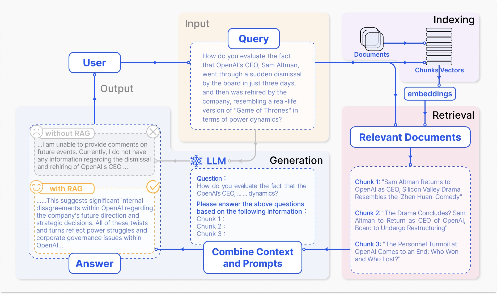
</div>


# Contents

- [Features](#features)
- [Online Retrieval Architecture](#online-retrieval-architecture)
- [Deploy the RAG-GPT Service](#deploy-the-rag-gpt-service)
  - [Step 1: Download repository code](#step-1-download-repository-code)
  - [Step 2: Configure variables of .env](#step-2-configure-variables-of-env)
    - [Using OpenAI as the LLM base](#using-openai-as-the-llm-base)
    - [Using ZhipuAI as the LLM base](#using-zhipuai-as-the-llm-base)
  - [Step 3: Deploy RAG-GPT](#step-3-deploy-rag-gpt)
    - [Deploy RAG-GPT using Docker](#deploy-rag-gpt-using-docker)
    - [Deploy RAG-GPT from source code](#deploy-rag-gpt-from-source-code)
    - [Set up the Python running environment](#set-up-the-python-running-environment)
      - [Create and activate a virtual environment](#create-and-activate-a-virtual-environment)
      - [Install dependencies with pip](#install-dependencies-with-pip)
    - [Create SQLite Database](#create-sqlite-database)
    - [Start the service](#start-the-service)
- [Configure the admin console](#configure-the-admin-console)
  - [Login to the admin console](#login-to-the-admin-console)
  - [Import your data](#import-your-data)
  - [Test the chatbot](#test-the-chatbot)
  - [Embed on your website](#embed-on-your-website)
  - [Dashboard of user's historical request](#dashboard-of-users-historical-request)
- [The frontend of admin console and chatbot](#the-frontend-of-admin-console-and-chatbot)
  - [admin console](#admin-console)
  - [chatbot](#chatbot)


## Features
- **Built-in LLM Support**: Provides integrated support for large language models.
- **Quick Setup**: Enables deployment of production-level conversational service robots within just five minutes.
- **Simple Maintenance**: Only requires Python, with no need for additional middleware.
- **Flexible Configuration**: Offers a user-friendly backend equipped with customizable settings for streamlined management.
- **Attractive UI**: Features a customizable and visually appealing user interface.


## Online Retrieval Architecture

<div align="center">
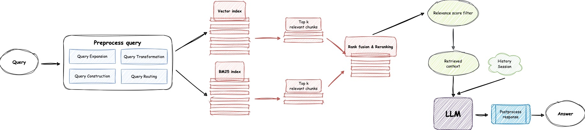
</div>


## Deploy the RAG-GPT Service

### Step 1: Download repository code

Clone the repository:

```shell
git clone https://github.com/open-kf/rag-gpt.git && cd rag-gpt
```

### Step 2: Configure variables of .env

Before starting the RAG-GPT service, you need to modify the related configurations for the program to initialize correctly. 

#### Using OpenAI as the LLM base

```shell
cp env_of_openai .env
```

The variables in .env

```shell
LLM_NAME="OpenAI"
OPENAI_API_KEY="xxxx"
GPT_MODEL_NAME="gpt-3.5-turbo"
MIN_RELEVANCE_SCORE=0.3
BOT_TOPIC="xxxx"
URL_PREFIX="http://127.0.0.1:7000/"
USE_PREPROCESS_QUERY=0
USE_RERANKING=1
USE_DEBUG=0
```

- Don't modify **`LLM_NAME`**
- Modify the **`OPENAI_API_KEY`** with your own key. Please log in to the [OpenAI website](https://platform.openai.com/api-keys) to view your API Key.
- Update the **`GPT_MODEL_NAME`** setting, replacing `gpt-3.5-turbo` with `gpt-4-turbo` if you wish to use GPT-4 Turbo.
- Change **`BOT_TOPIC`** to reflect your Bot's name. This is very important, as it will be used in `query rewriting` and `result rewriting`. Please try to use a concise and clear word, such as `OpenIM`, `LangChain`.
- Adjust **`URL_PREFIX`** to match your website's domain.
- For more information about the meanings and usages of constants, you can check under the `server/constant` directory.

#### Using ZhipuAI as the LLM base

If you cannot use OpenAI's API services, consider using ZhipuAI as an alternative.

```shell
cp env_of_zhipuai .env
```

The variables in .env

```shell
LLM_NAME="ZhipuAI"
ZHIPUAI_API_KEY="xxxx"
GLM_MODEL_NAME="glm-3-turbo"
MIN_RELEVANCE_SCORE=0.3
BOT_TOPIC="xxxx"
URL_PREFIX="http://127.0.0.1:7000/"
USE_PREPROCESS_QUERY=0
USE_RERANKING=1
USE_DEBUG=0
```

- Don't modify **`LLM_NAME`**
- Modify the **`ZHIPUAI_API_KEY`** with your own key. Please log in to the [ZhipuAI website](https://open.bigmodel.cn/usercenter/apikeys) to view your API Key.
- Update the **`GLM_MODEL_NAME`** setting, replacing `glm-3-turbo` with `glm-4` if you wish to use GLM-4.
- Change **`BOT_TOPIC`** to reflect your Bot's name. This is very important, as it will be used in `query rewriting` and `result rewriting`. Please try to use a concise and clear word, such as `OpenIM`, `LangChain`.
- Adjust **`URL_PREFIX`** to match your website's domain.
- For more information about the meanings and usages of constants, you can check under the `server/constant` directory.


### Step 3: Deploy RAG-GPT
#### Deploy RAG-GPT using Docker

```shell
docker-compose up --build
```

#### Deploy RAG-GPT from source code

##### Set up the Python running environment

It is recommended to install Python-related dependencies in a Python virtual environment to avoid affecting dependencies of other projects.

###### Create and activate a virtual environment

If you have not yet created a virtual environment, you can create one with the following command:

```shell
python3 -m venv myenv
```

After creation, activate the virtual environment:

```shell
source myenv/bin/activate
```

###### Install dependencies with pip

Once the virtual environment is activated, you can use `pip` to install the required dependencies. 

```shell
pip install -r requirements.txt
```

##### Create SQLite Database

The RAG-GPT service uses SQLite as its storage DB. Before starting the RAG-GPT service, you need to execute the following command to initialize the database and add the default configuration for admin console.

```shell
python3 create_sqlite_db.py
```

##### Start the service

If you have completed the steps above, you can try to start the RAG-GPT service by executing the following command.

- **Start single process:**

```shell
python3 rag_gpt_app.py
```

- **Start multiple processes:**

```shell
sh start.sh
```

> [!NOTE]
> - The service port for RAG-GPT is **`7000`**. During the first test, please try not to change the port so that you can quickly experience the entire product process.
> - We recommend starting the RAG-GPT service using **`start.sh`** in multi-process mode for a smoother user experience.


## Configure the admin console

### Login to the admin console

Access the admin console through the link **`http://your-server-ip:7000/open-kf-admin/`** to reach the login page. The default username and password are **`admin`** and **`open_kf_AIGC@2024`** (can be checked in `create_sqlite_db.py`).

<div align="center">
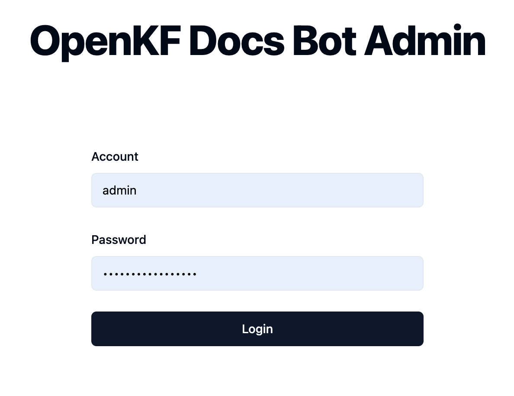
</div>

After logging in successfully, you will be able to see the configuration page of the admin console.

<div align="center">
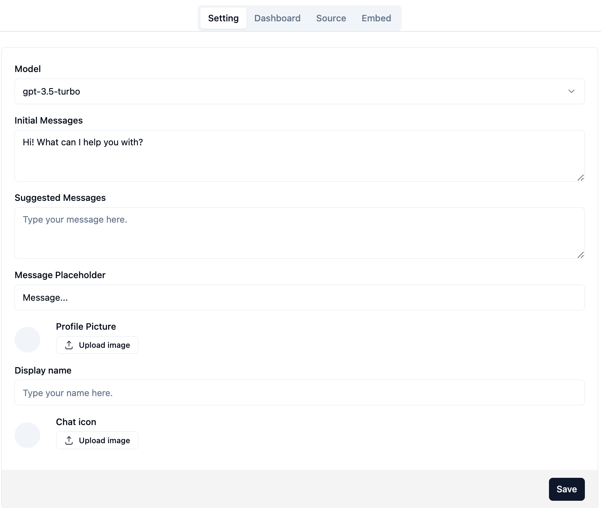
</div>

On the page **`http://your-server-ip:7000/open-kf-admin/#/`**, you can set the following configurations:
- Choose the LLM base, currently only the `gpt-3.5-turbo` option is available, which will be gradually expanded.
- Initial Messages
- Suggested Messages
- Message Placeholder
- Profile Picture (upload a picture)
- Display name
- Chat icon (upload a picture)

### Import your data

After submitting the website URL, once the server retrieves the list of all web page URLs via crawling, you can select the web page URLs you need as the knowledge base (all selected by default). The initial `Status` is **`Recorded`**.

<div align="center">
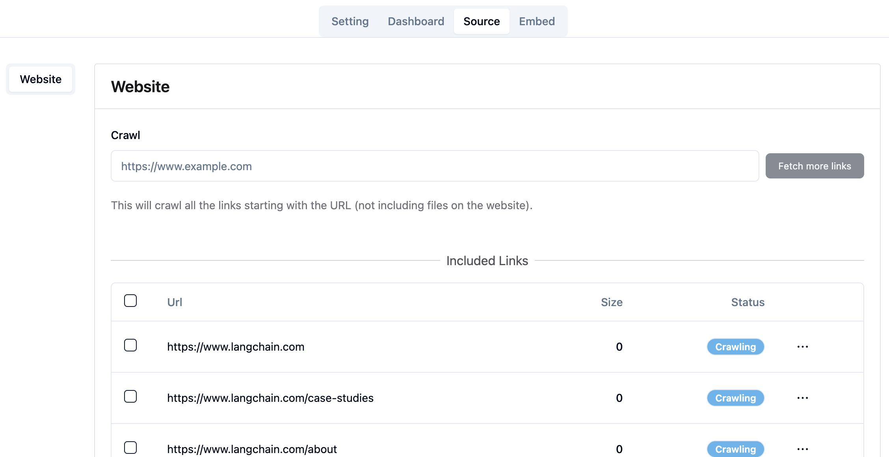
</div>

You can actively refresh the page **`http://your-server-ip:7000/open-kf-admin/#/source`** in your browser to get the progress of web page URL processing. After the content of the web page URL has been crawled, and the Embedding calculation and storage are completed, you can see the corresponding `Size` in the admin console, and the `Status` will also be updated to **`Stored`**.

<div align="center">
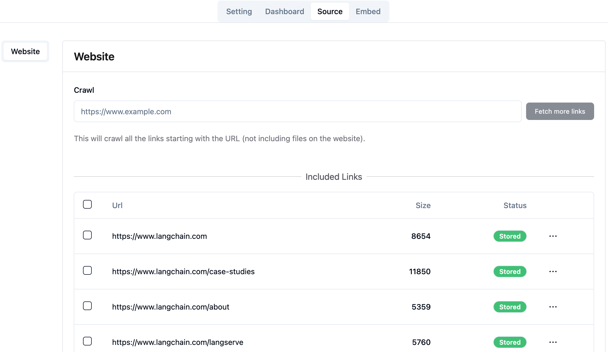
</div>

Clicking on a webpage's URL reveals how many sub-pages the webpage is divided into, and the text size of each sub-page.

<div align="center">
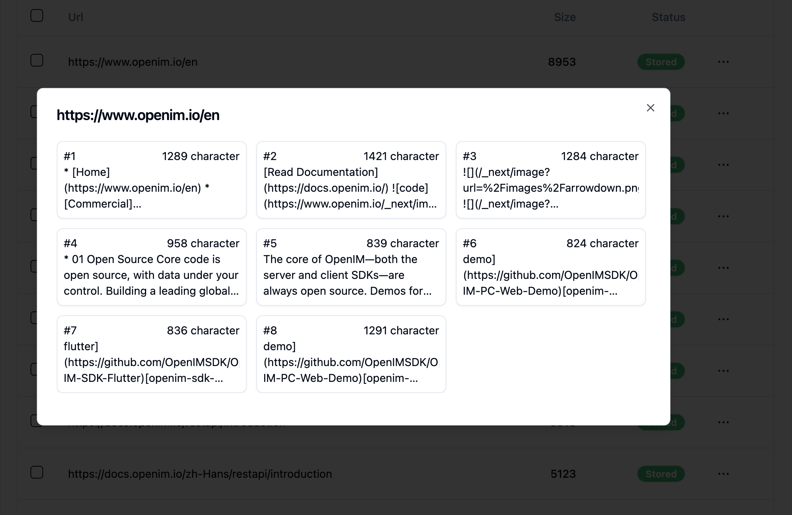
</div>

Clicking on a sub-page allows you to view its full text content. This will be very helpful for verifying the effects during the experience testing process.

<div align="center">
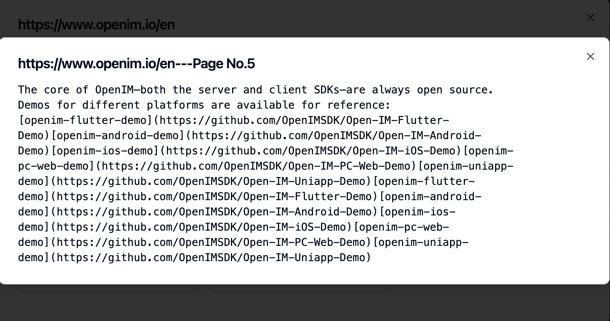
</div>

### Test the chatbot

After importing website data in the admin console, you can experience the chatbot service through the link **`http://your-server-ip:7000/open-kf-chatbot/`**.

<div align="center">
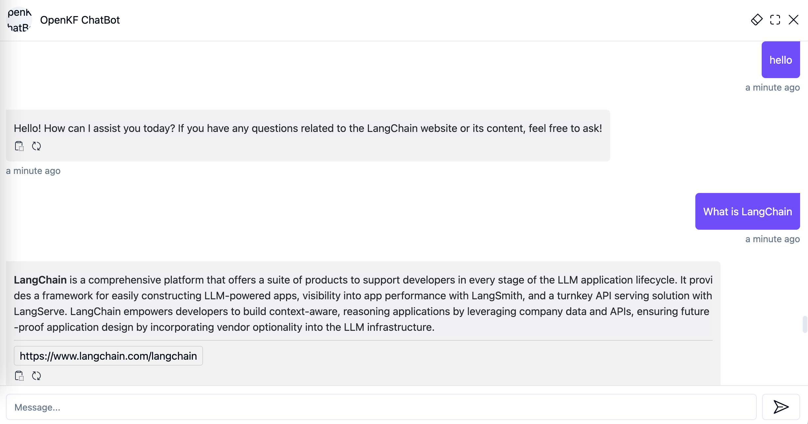
</div>

### Embed on your website

Through the admin console link **`http://your-server-ip:7000/open-kf-admin/#/embed`**, you can see the detailed tutorial for configuring the iframe in your website.

<div align="center">
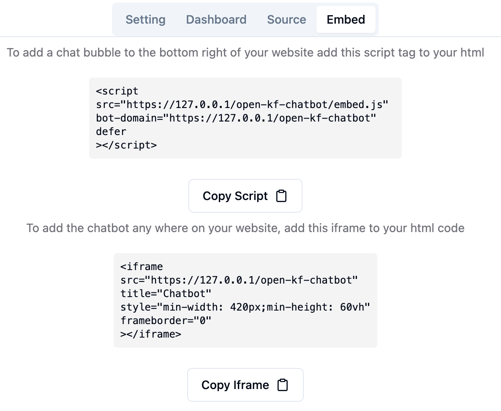
</div>

<div align="center">
<br/>
<a href="https://docs.openim.io/" target="_blank"> OpenIM chatbot </a>
<br/>
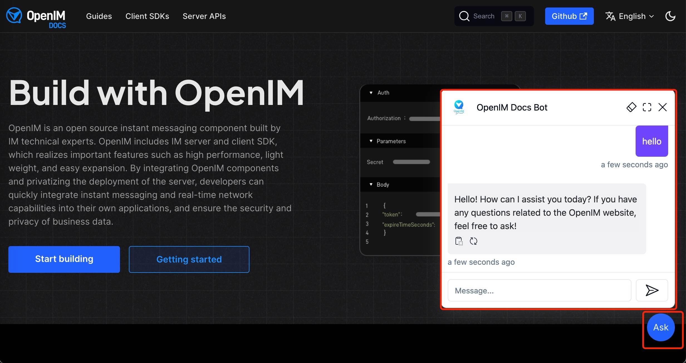
</div>

### Dashboard of user's historical request

Through the admin console link **`http://your-server-ip:7000/open-kf-admin/#/dashboard`**, you can view the historical request records of all users within a specified time range.

<div align="center">
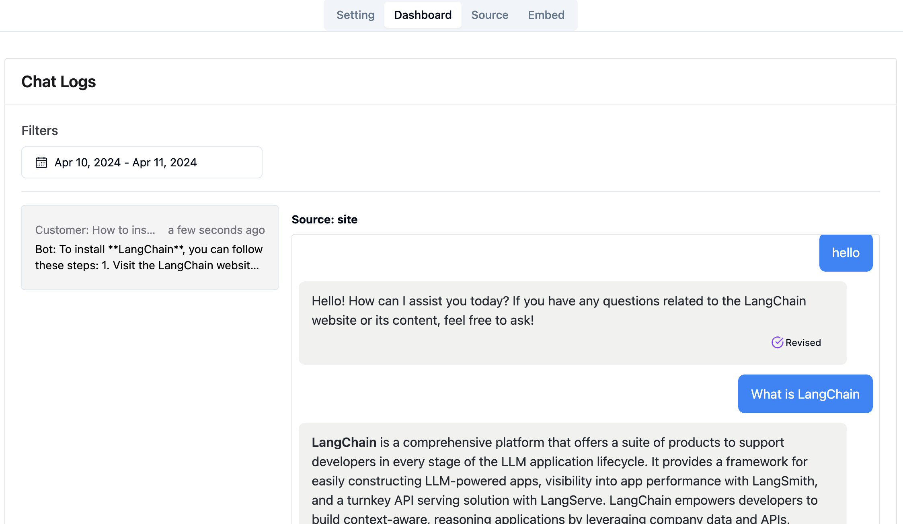
</div>


## The frontend of admin console and chatbot
The RAG-GPT service integrates 2 frontend modules, and their source code information is as follows:

### admin console
> [Code Repository](https://github.com/open-kf/smart-qa-admin)

An intuitive web-based admin interface for Smart QA Service, offering comprehensive control over content, configuration, and user interactions. Enables effortless management of the knowledge base, real-time monitoring of queries and feedback, and continuous improvement based on user insights.

### chatbot
> [Code Repository](https://github.com/open-kf/smart-qa-h5)

An HTML5 interface for Smart QA Service designed for easy integration into websites via iframe, providing users direct access to a tailored knowledge base without leaving the site, enhancing functionality and immediate query resolution.

