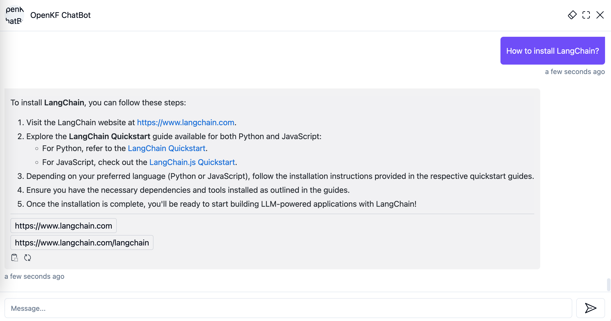

<div align="center">
<h1 align="center">Smart QA Service</h1>
Quickly launch an intelligent customer service system with Flask, LLM, RAG, including frontend, backend, and admin console.
<br/>

</div>


## Deploy the OpenKF Service

### 1. Download repository code

Clone the repository:

```shell
git clone https://github.com/open-kf/smart-qa-service
```

### 2. Set up the Python running environment

It is recommended to install Python-related dependencies in a Python virtual environment to avoid affecting dependencies of other projects.

#### Create and activate a virtual environment

If you have not yet created a virtual environment, you can create one with the following command:

```shell
python3 -m venv myenv
```

After creation, activate the virtual environment:

```shell
source myenv/bin/activate
```

#### Install dependencies with pip

Once the virtual environment is activated, you can use `pip` to install the required dependencies. 

```shell
pip install -r requirements.txt
```

### 3. Configure variables of .env

Before starting the OpenKF service, you need to modify the related configurations for the program to initialize correctly. 

```shell
copy env_template .env
```

The variables in .env

```env
SQLITE_DB_DIR="sqlite_dir"
SQLITE_DB_NAME="mydatabase.sqlite3"
MAX_CRAWL_PARALLEL_REQUEST=5
CHROMA_DB_DIR="chroma_dir"
CHROMA_COLLECTION_NAME="mychroma_collection"
OPENAI_API_KEY="xxxx"
GPT_MODEL_NAME="gpt-3.5-turbo"
OPENAI_EMBEDDING_MODEL_NAME="text-embedding-3-small"
MAX_QUERY_SIZE=200
RECALL_TOP_K=3
MAX_HISTORY_QUERY_SIZE=5
HISTORY_EXPIRE_TIME=10800
MAX_EMBEDDING_INPUT=2048
SITE_TITLE="your site title"
STATIC_DIR="web"
URL_PREFIX="http://127.0.0.1:7000/"
MEDIA_DIR="media_dir"
```

- Modify `OPENAI_API_KEY` to your own key, which can be obtained by logging into the [OpenAI dashboard](https://platform.openai.com/api-keys):
- Modify `SITE_TITLE` to your website's name.
- Modify `URL_PREFIX` according to your website's domain.


### 4. Create SQLite Database

The OpenKF service uses SQLite as its storage DB. Before starting the OpenKF service, you need to execute the following command to initialize the database and add the default configuration for admin console.

```shell
python3 create_sqlite_db.py
```

### 5. Install Redis

The OpenKF service relies on Redis as its caching service. If Redis is already installed, start Redis and listen on port `6379`. If not installed, refer to the following method for installation.

```shell
docker run --name redis -d -p 6379:6379 redis
```

### 6. Start the service

If you have completed the steps above, you can try to start the OpenKF service by executing the following command.

- **Start single process:**

```shell
python smart_qa_app.py
```

- **Start multiple processes:**

```shell
sh start.sh
```

> [!NOTE]
> - The service port for OpenKF is **`7000`**. During the first test, please try not to change the port so that you can quickly experience the entire product process.
> - We recommend starting the OpenKF service using **`start.sh`** in multi-process mode for a smoother user experience.


## Configure the admin console

### 1. Log in to the admin console

Access the admin console through the link **`http://127.0.0.1:7000/open-kf-admin/`** to reach the login page. The default username and password are **`admin`** and **`open_kf_AIGC@2024`** (can be checked in `create_sqlite_db.py`).

<div align="center">

</div>

After logging in successfully, you will be able to see the configuration page of the admin console.

<div align="center">

</div>

On the page **`http://127.0.0.1:7000/open-kf-admin/#/`**, you can set the following configurations:
- Choose the LLM base, currently only the `gpt-3.5-turbo` option is available, which will be gradually expanded.
- Initial Messages
- Suggested Messages
- Message Placeholder
- Profile Picture (upload a picture)
- Display name
- Chat icon (upload a picture)

### 2. Import your data

After submitting the website URL, once the server retrieves the list of all web page URLs via crawling, you can select the web page URLs you need as the knowledge base (all selected by default).

<div align="center">

</div>

You can actively refresh the page **`http://127.0.0.1:7000/open-kf-admin/#/source`** in your browser to get the progress of web page URL processing. After the content of theweb page URL has been crawled, and the Embedding calculation and storage are completed, you can see the corresponding `Size` in the admin console, and the `Status` will also be updated to **`Stored`**.

<div align="center">

</div>

### 3. Test the chatbot

After importing website data in the admin console, you can experience the chatbot service through the link **`http://127.0.0.1:7000/open-kf-chatbot/`**.

<div align="center">

</div>

### 4. Embed on your website

Through the admin console link **`http://127.0.0.1:7000/open-kf-admin/#/embed`**, you can see the detailed tutorial for configuring the iframe in your website.

<div align="center">

</div>

<div align="center">
<br/>
<a href="https://docs.openim.io/" target="_blank"> OpenIM chatbot </a>
<br/>

</div>

### 5. View the user's chatbot visit history

Through the admin console link **`http://127.0.0.1:7000/open-kf-admin/#/dashboard`**, you can view the historical request records of all users within a specified time range.

<div align="center">

</div>


## The frontend of admin console and chatbot
The OpenKF service integrates 2 frontend modules, and their source code information is as follows:

### admin console
> [Code Repository](https://github.com/open-kf/smart-qa-admin)

An intuitive web-based admin interface for Smart QA Service, offering comprehensive control over content, configuration, and user interactions. Enables effortless management of the knowledge base, real-time monitoring of queries and feedback, and continuous improvement based on user insights.

### chatbot
> [Code Repository](https://github.com/open-kf/smart-qa-h5)

An HTML5 interface for Smart QA Service designed for easy integration into websites via iframe, providing users direct access to a tailored knowledge base without leaving the site, enhancing functionality and immediate query resolution.

